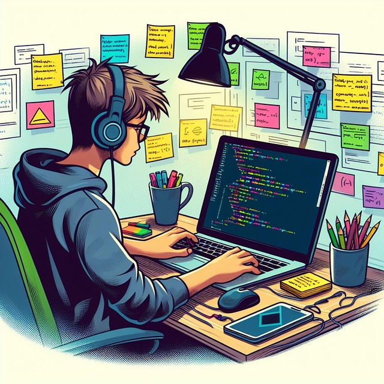
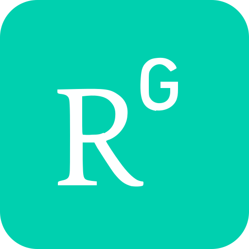
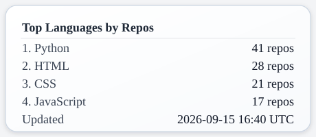
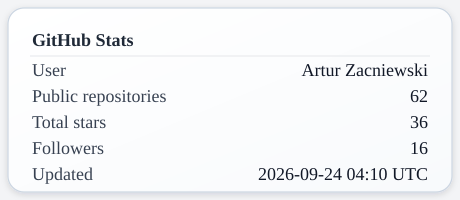
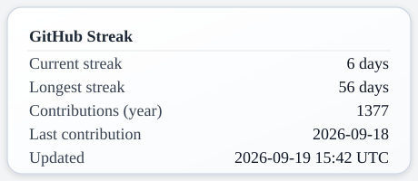

<div align="center">
  
  <h1>Hi, I'm Artur – developer and educator from Poland</h1>
</div>

<br/>

<div align="center">
  <table border="0" cellspacing="0" cellpadding="0">
    <tr>
      <td width="300" align="center" valign="middle">
        
      </td>
      <td width="300" align="center" valign="middle">
        <h3>Connect with me:</h3>
        <p>
          <a href="https://linkedin.com/in/artur-zacniewski-29436928" target="_blank">
            
          </a>
          &nbsp;&nbsp;
          <a href="https://www.researchgate.net/profile/Artur_Zacniewski" target="_blank">
            
          </a>
          &nbsp;&nbsp;
          <a href="https://www.kaggle.com/zacniewski" target="_blank">
            
          </a>
        </p>
      </td>
    </tr>
  </table>
</div>


----  


<h3 align="center">🛠️ Tech Stack</h3>

<p align="center">
  
  
  
  
  
  
  
  
  
</p>

<br/>

<h3 align="center">📊 Statistics</h3>

<p align="center">
  
  
</p>
<p align="center">
  
</p>

----

<h3 align="center">📊 Recently used languages</h3>


<!--START_SECTION:waka-->

```txt
From: 14 February 2026 - To: 02 September 2026

Total Time: 194 hrs 9 mins

Markdown                   79 hrs 28 mins        ██████████▒░░░░░░░░░░░░░░   40.91 %
Python                     47 hrs 16 mins        ██████░░░░░░░░░░░░░░░░░░░   24.33 %
HTML                       19 hrs 39 mins        ██▓░░░░░░░░░░░░░░░░░░░░░░   10.12 %
YAML                       10 hrs 36 mins        █▒░░░░░░░░░░░░░░░░░░░░░░░   05.46 %
GitIgnore file             5 hrs 31 mins         ▓░░░░░░░░░░░░░░░░░░░░░░░░   02.84 %
Text                       4 hrs 31 mins         ▓░░░░░░░░░░░░░░░░░░░░░░░░   02.33 %
Bash                       4 hrs 19 mins         ▓░░░░░░░░░░░░░░░░░░░░░░░░   02.23 %
Docker                     4 hrs                 ▓░░░░░░░░░░░░░░░░░░░░░░░░   02.06 %
SQL                        3 hrs 47 mins         ▒░░░░░░░░░░░░░░░░░░░░░░░░   01.95 %
JSON                       2 hrs 56 mins         ▒░░░░░░░░░░░░░░░░░░░░░░░░   01.52 %
Java                       2 hrs 51 mins         ▒░░░░░░░░░░░░░░░░░░░░░░░░   01.47 %
TOML                       2 hrs 49 mins         ▒░░░░░░░░░░░░░░░░░░░░░░░░   01.45 %
JavaScript                 1 hr 32 mins          ▒░░░░░░░░░░░░░░░░░░░░░░░░   00.79 %
Requirements.txt           58 mins               ░░░░░░░░░░░░░░░░░░░░░░░░░   00.50 %
.env file                  55 mins               ░░░░░░░░░░░░░░░░░░░░░░░░░   00.48 %
```

<!--END_SECTION:waka-->
