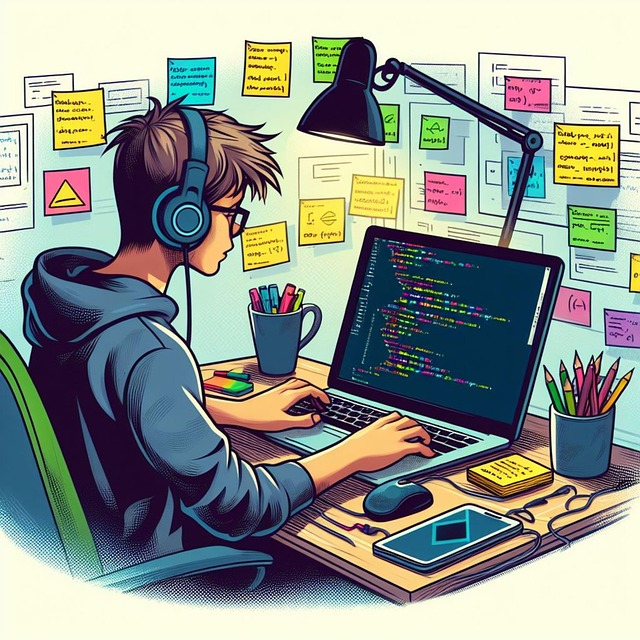
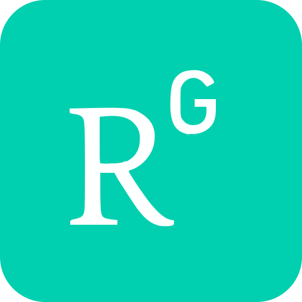
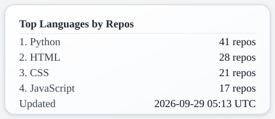
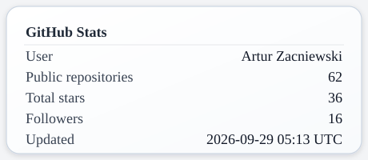
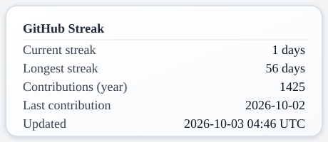

<div align="center">
  
  <h1>Hi, I'm Artur – developer and educator from Poland</h1>
</div>

<br/>

<div align="center">
  <table border="0" cellspacing="0" cellpadding="0">
    <tr>
      <td width="300" align="center" valign="middle">
        
      </td>
      <td width="300" align="center" valign="middle">
        <h3>Connect with me:</h3>
        <p>
          <a href="https://linkedin.com/in/artur-zacniewski-29436928" target="_blank">
            
          </a>
          &nbsp;&nbsp;
          <a href="https://www.researchgate.net/profile/Artur_Zacniewski" target="_blank">
            
          </a>
          &nbsp;&nbsp;
          <a href="https://www.kaggle.com/zacniewski" target="_blank">
            
          </a>
        </p>
      </td>
    </tr>
  </table>
</div>


----  


<h3 align="center">🛠️ Tech Stack</h3>

<p align="center">
  
  
  
  
  
  
  
  
  
</p>

<br/>

<h3 align="center">📊 Statistics</h3>

<p align="center">
  
  
</p>
<p align="center">
  
</p>

----

<h3 align="center">📊 Recently used languages</h3>


<!--START_SECTION:waka-->

```txt
From: 14 February 2026 - To: 06 October 2026

Total Time: 215 hrs 15 mins

Markdown                   88 hrs 36 mins        ██████████▒░░░░░░░░░░░░░░   41.14 %
Python                     52 hrs 55 mins        ██████░░░░░░░░░░░░░░░░░░░   24.57 %
HTML                       20 hrs 39 mins        ██▒░░░░░░░░░░░░░░░░░░░░░░   09.59 %
YAML                       11 hrs 17 mins        █▒░░░░░░░░░░░░░░░░░░░░░░░   05.24 %
GitIgnore file             6 hrs 36 mins         ▓░░░░░░░░░░░░░░░░░░░░░░░░   03.07 %
Text                       5 hrs 52 mins         ▓░░░░░░░░░░░░░░░░░░░░░░░░   02.73 %
Bash                       4 hrs 54 mins         ▓░░░░░░░░░░░░░░░░░░░░░░░░   02.28 %
Docker                     4 hrs                 ▒░░░░░░░░░░░░░░░░░░░░░░░░   01.86 %
SQL                        3 hrs 47 mins         ▒░░░░░░░░░░░░░░░░░░░░░░░░   01.76 %
TOML                       3 hrs 26 mins         ▒░░░░░░░░░░░░░░░░░░░░░░░░   01.60 %
Java                       3 hrs 14 mins         ▒░░░░░░░░░░░░░░░░░░░░░░░░   01.51 %
JSON                       3 hrs 5 mins          ▒░░░░░░░░░░░░░░░░░░░░░░░░   01.43 %
JavaScript                 1 hr 36 mins          ▒░░░░░░░░░░░░░░░░░░░░░░░░   00.75 %
.env file                  1 hr 7 mins           ░░░░░░░░░░░░░░░░░░░░░░░░░   00.52 %
Requirements.txt           58 mins               ░░░░░░░░░░░░░░░░░░░░░░░░░   00.45 %
```

<!--END_SECTION:waka-->
